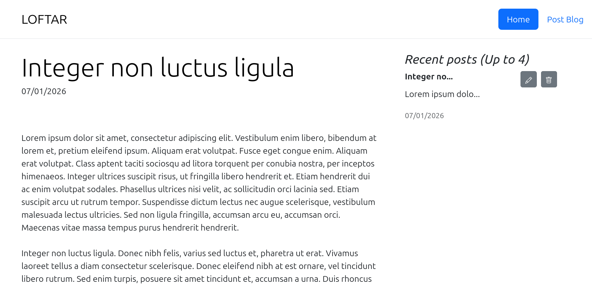
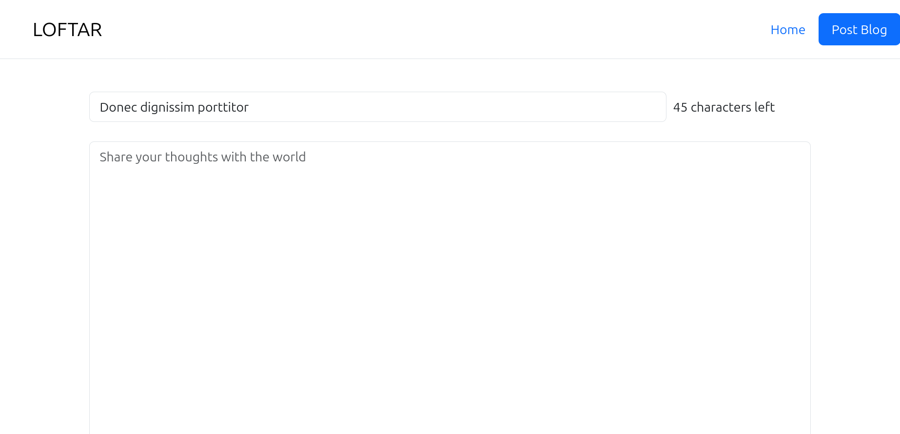

# Lil-blog-app
A blog website where users can post new blogs, edit or delete existing blogs. Note the data is stored in the server, so no memory.

Screenshots of the home page and edit page:

To run the project, run `npm i` in the terminal under the root path of this repository. After all packages are installed, run `node index.js`, and enter `localhost:3000` in your browser, now you can test the website.
